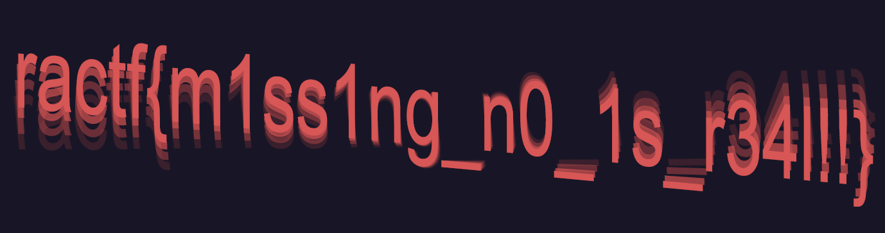

# **RACTF 2020**

<p align="center">

</p>

RACTF is a student-run, extensible, open-source, capture-the-flag event.

In more human terms, we run a set of cyber-security challenges, of many different varieties, with many difficulty levels, for the sole purposes of having fun and learning new skills.

This is the ninth CTF I participated in and by far the best one, the challenges were great, funny and not too guessy, the framework was really good and stable (in other words not CTFd), and the CTF team were friendly and helpful.\
In the end I finished most of the crypto, misc, osint and web challenges (I will add more when I'll have time) and ended up around 100th in the leaderboard (I played solo so it's not too shaby), this is my second writeup and hopefully more will come, if you have any comments, questions, or found any error (which I'm sure there are plenty of) please let me know. Thanks for reading!

***

# Table of Contents
* [Miscellaneous](#Miscellaneous)
  - [Discord](#discord)
  - [Spentalkux](#spentalkux)
  - [pearl pearl pearl](#pearl-pearl-pearl)
  - [Reading Beetwen the Lines](#reading-between-the-lines)
  - [Mad CTF Disease](#mad-ctf-disease)
  - [Teleport](#teleport)
* [Cryptography](#cryptography)
  - [Really Simple Algorithm](#really-simple-algorithm)
  - [Really Small Algorithm](#really-small-algorithm)
  - [Really Speedy Algorithm](#really-speedy-algorithm)
  - [B007l3G CRYP70](#b007l3g-cryp70)
* [Steg / Forensics](#steg--forensics)
  - [Cut short](#cut-short)
  - [Dimensionless Loading](#dimensionless-loading)


***
# Miscellaneous

## Discord
(for the sake of completion)

Join our discord over at https://discord.gg/Rrhdvzn and see if you can find the flag somewhere.

**ractf{the_game_begins}**

**Solution:** the flag is pinned in #general channel in the discord server.

## Spentalkux
 Spentalkux 🐍📦

 **ractf{My5t3r10u5_1nt3rf4c3?}**

 **Solution:** We don't get a lot of information, but we can assume by the emojis that the challenge has something to do with python packages, if we serach for the word Spentalkux on google we can find this package:


I downloaded the package (linked below) and examined the files, in the package we can find the \_\_init\_\_.py file which has the following code:
```python
import base64
p="""
aW1wb3J0IHRpbWUKCmdvX2F3YXlfbXNncyA9IFsiR29vZGJ5ZSBub3cuIiwgIlRoYXQncyB5b3VyIGN1ZSB0byBsZWF2ZSwgYnJvIiwgIkV4aXQgc3RhZ2UgbGVmdCwgcGFsIiwgIk9GRiBZT1UgUE9QLiIsICJZb3Uga25vdyB3aGF0IEkgaGF2ZW4ndCBnb3QgdGltZSBmb3IgdGhpcyIsICJGb3JraW5nIGFuZCBleGVjdXRpbmcgcm0gLXJmLiJdCgp0aW1lLnNsZWVwKDEpCnByaW50KCJIZWxsby4iKQp0aW1lLnNsZWVwKDIpCnByaW50KCJDYW4gSSBoZWxwIHlvdT8iKQp0aW1lLnNsZWVwKDIpCnByaW50KCJPaCwgeW91J3JlIGxvb2tpbmcgZm9yIHNvbWV0aGluZyB0byBkbyB3aXRoICp0aGF0Ki4iKQp0aW1lLnNsZWVwKDIpCnByaW50KCJNeSBjcmVhdG9yIGxlZnQgdGhpcyBiZWhpbmQgYnV0LCBJIHdvbmRlciB3aGF0IHRoZSBrZXkgaXM/IEkgZG9uJ3Qga25vdywgYnV0IGlmIEkgZGlkIEkgd291bGQgc2F5IGl0J3MgYWJvdXQgMTAgY2hhcmFjdGVycy4iKQp0aW1lLnNsZWVwKDQpCnByaW50KCJFbmpveSB0aGlzLiIpCnRpbWUuc2xlZXAoMSkKcHJpbnQoIlp0cHloLCBJcSBpaXInanQgdnJ0ZHR4YSBxenh3IGxodSdnbyBneGZwa3J3IHR6IHBja3YgYmMgeWJ0ZXZ5Li4uICpmZmlpZXlhbm8qLiBOZXcgY2lrbSBzZWthYiBndSB4dXggY3NrZml3Y2tyIGJzIHpmeW8gc2kgbGdtcGQ6Ly96dXBsdGZ2Zy5jencvbHhvL1FHdk0wc2E2IikKdGltZS5zbGVlcCg1KQpmb3IgaSBpbiBnb19hd2F5X21zZ3M6CiAgICB0aW1lLnNsZWVwKDMpCiAgICBwcmludChpKQp0aW1lLnNsZWVwKDAuNSk=
"""
exec(base64.b64decode(p.encode("ascii")))
```
We can see that this massive block of seemingly random characters is encoded to ascii and then decoded to base64, a type of encoding which uses letter, numbers and symbols to represent a value, so I plugged the block of text to Cyberchef to decode the data and got the following script:

```python
import time

go_away_msgs = ["Goodbye now.", "That's your cue to leave, bro", "Exit stage left, pal", "OFF YOU POP.", "You know what I haven't got time for this", "Forking and executing rm -rf."]

time.sleep(1)
print("Hello.")
time.sleep(2)
print("Can I help you?")
time.sleep(2)
print("Oh, you're looking for something to do with *that*.")
time.sleep(2)
print("My creator left this behind but, I wonder what the key is? I don't know, but if I did I would say it's about 10 characters.")
time.sleep(4)
print("Enjoy this.")
time.sleep(1)
print("Ztpyh, Iq iir'jt vrtdtxa qzxw lhu'go gxfpkrw tz pckv bc ybtevy... *ffiieyano*. New cikm sekab gu xux cskfiwckr bs zfyo si lgmpd://zupltfvg.czw/lxo/QGvM0sa6")
time.sleep(5)
for i in go_away_msgs:
    time.sleep(3)
    print(i)
time.sleep(0.5)
```
I think I needed to import the package to a script and run it but oh well we still got the message, so we are given another unreadable text  which we can assume is a ciphertext with a key of length 10 as the messages suggested, we can infer by the ciphertext that it's a Vigenere cipher beacuse the format of the text and the format of the url in the end suggests that the letters were substituted (and it is common to use Vigenere in CTF so it's an easy assumption), I first attempted to decrypt the url using Cyberchef with the assumption that it starts with https and got the substring of the key 'ental', and after trying to get other parts of the url decrpyted I noticed that the key is similar to the name of the package, so I used that as a key et voila:
```
Hello, If you're reading this you've managed to find my little... *interface*. The next stage of the challenge is over at https://pastebin.com/raw/BCiT0sp6
```
We got ourself the decrpyted message.\ In the messege is a url to some data hosted on pastebin, if you look at the site you'll see that the data consists of numbers from 1 to 9 and some uppercase letters, only from A to F (I will not show it here beacuse it's massive), I assumed that it was an hex encoding of something and by the sheer size of it I gueesed that it's also a file, so I used an hex editor and created a new file with the data and it turns out to be an PNG image file (you can check things like that using the file command in linux), the image is:


So we need to look back into the past... maybe there is an earlier version of this package (btw the binary below is decoded to _herring which I have no clue what it means), when we check the release history of the spentalkux package in pypi.org we can see that there is a 0.9 version of it, so I downloaded this package and again looked at the \_\_init\_\_.py file, it contains the following code:
```python
import base64
p="""
aW1wb3J0IHRpbWUKCmdvX2F3YXlfbXNncyA9IFsiVGhpcyBpcyB0aGUgcGFydCB3aGVyZSB5b3UgKmxlYXZlKiwgYnJvLiIsICJMb29rLCBpZiB5b3UgZG9uJ3QgZ2V0IG91dHRhIGhlcmUgc29vbiBpbWEgcnVuIHJtIC1yZiBvbiB5YSIsICJJIGRvbid0IHdhbnQgeW91IGhlcmUuIEdPIEFXQVkuIiwgIkxlYXZlIG1lIGFsb25lIG5vdy4iLCAiR09PREJZRSEiLCAiSSB1c2VkIHRvIHdhbnQgeW91IGRlYWQgYnV0Li4uIiwgIm5vdyBJIG9ubHkgd2FudCB5b3UgZ29uZS4iXQoKdGltZS5zbGVlcCgxKQpwcmludCgiVXJnaC4gTm90IHlvdSBhZ2Fpbi4iKQp0aW1lLnNsZWVwKDIpCnByaW50KCJGaW5lLiBJJ2xsIHRlbGwgeW91IG1vcmUuIikKdGltZS5zbGVlcCgyKQpwcmludCgiLi4uIikKdGltZS5zbGVlcCgyKQpwcmludCgiQnV0LCBiZWluZyB0aGUgY2hhb3RpYyBldmlsIEkgYW0sIEknbSBub3QgZ2l2aW5nIGl0IHRvIHlvdSBpbiBwbGFpbnRleHQuIikKdGltZS5zbGVlcCg0KQpwcmludCgiRW5qb3kgdGhpcy4iKQp0aW1lLnNsZWVwKDEpCnByaW50KCJKQTJIR1NLQkpJNERTWjJXR1JBUzZLWlJMSktWRVlLRkpGQVdTT0NUTk5URkNLWlJGNUhUR1pSWEpWMkVLUVRHSlZUWFVPTFNJTVhXSTJLWU5WRVVDTkxJS041SEszUlRKQkhHSVFUQ001UkhJVlNRR0ozQzZNUkxKUlhYT1RKWUdNM1hPUlNJSk40RlVZVE5JVTRYQVVMR09OR0U2WUxKSlJBVVlPRExPWkVXV05DTklKV1dDTUpYT1ZURVFVTENKRkZFR1dEUEs1SEZVV1NMSTVJRk9RUlZLRldHVTVTWUpGMlZRVDNOTlVZRkdaMk1ORjRFVTVaWUpCSkVHT0NVTUpXWFVOM1lHVlNVUzQzUVBGWUdDV1NJS05MV0UyUllNTkFXUVpES05SVVRFVjJWTk5KREM0M1dHSlNGVTNMWExCVUZVM0NFTlpFV0dRM01HQkRYUzRTR0xBM0dNUzNMSUpDVUVWQ0NPTllTV09MVkxFWkVLWTNWTTRaRkVaUlFQQjJHQ1NUTUpaU0ZTU1RWUEJWRkFPTExNTlNEQ1RDUEs0WFdNVUtZT1JSREM0M0VHTlRGR1ZDSExCREZJNkJUS1ZWR01SMkdQQTNIS1NTSE5KU1VTUUtCSUUiKQp0aW1lLnNsZWVwKDUpCmZvciBpIGluIGdvX2F3YXlfbXNnczoKICAgIHRpbWUuc2xlZXAoMikKICAgIHByaW50KGkpCnRpbWUuc2xlZXAoMC41KQ=="""
exec(base64.b64decode(p.encode("ascii")))
```
we again have a base64 encoded message, plugging it to Cyberchef gives us:

```python
import time

go_away_msgs = ["This is the part where you *leave*, bro.", "Look, if you don't get outta here soon ima run rm -rf on ya", "I don't want you here. GO AWAY.", "Leave me alone now.", "GOODBYE!", "I used to want you dead but...", "now I only want you gone."]

time.sleep(1)
print("Urgh. Not you again.")
time.sleep(2)
print("Fine. I'll tell you more.")
time.sleep(2)
print("...")
time.sleep(2)
print("But, being the chaotic evil I am, I'm not giving it to you in plaintext.")
time.sleep(4)
print("Enjoy this.")
time.sleep(1)
print("JA2HGSKBJI4DSZ2WGRAS6KZRLJKVEYKFJFAWSOCTNNTFCKZRF5HTGZRXJV2EKQTGJVTXUOLSIMXWI2KYNVEUCNLIKN5HK3RTJBHGIQTCM5RHIVSQGJ3C6MRLJRXXOTJYGM3XORSIJN4FUYTNIU4XAULGONGE6YLJJRAUYODLOZEWWNCNIJWWCMJXOVTEQULCJFFEGWDPK5HFUWSLI5IFOQRVKFWGU5SYJF2VQT3NNUYFGZ2MNF4EU5ZYJBJEGOCUMJWXUN3YGVSUS43QPFYGCWSIKNLWE2RYMNAWQZDKNRUTEV2VNNJDC43WGJSFU3LXLBUFU3CENZEWGQ3MGBDXS4SGLA3GMS3LIJCUEVCCONYSWOLVLEZEKY3VM4ZFEZRQPB2GCSTMJZSFSSTVPBVFAOLLMNSDCTCPK4XWMUKYORRDC43EGNTFGVCHLBDFI6BTKVVGMR2GPA3HKSSHNJSUSQKBIE")
time.sleep(5)
for i in go_away_msgs:
    time.sleep(2)
    print(i)
time.sleep(0.5)
```

And we got another decrypted/decoded code, we can see that it consists only of letters and numbers, in the hope that this isn't some ciphertext I tried using base32 as it only uses letters and numbers (and too many letters to be hexadecimal), by doing so we get another code which consists of letters, numbers and symbols so we can safely assume that this is base64 again, and decoding the data from base64 we get...

```
.....=.^.ÿíYQ.. .¼JGÐû_ÎÝþÌ´@_2.ý¬/Ý.y...RÎé÷.×An.íTý¯ÿo.£.<ß¼..¬Yna=¥.ì,æ¢,.ü.ò$àÀfk^î|t. ..¡cYd¡.X.P.;×"åÎ.m..¸±'..D/.nlûÇ..².©i.ÒY¸üp.].X¶YI.ÖËöu.°^.e.r.
].ʱWéò¤.@S.ʾöæ6.Ë Ù.ôÆÖ..×X&ìc?Ù.wRÎ[÷Ð^Öõ±ÝßI1..<wR7Æ..®$hÞ ..
```
...yeah this doesn't look good, but without losing hope and checked if this is a file, so I downloaded the data and fortunately it is one, a gz compressed data file in fact:

[link to file](assets//files//Spentalkux.gz)

In this file we got another decoded/decrpyted data (I really lost count of how many were in this challenge by now), the data consists only of 1 and 0 so most of the time it is one of three things - binary data, morse code or bacon code, so I first checked if it's binary and got another block of binary data, decoding it we get data which looks like hex and decoding that we get...weird random-looking data, so it is obviously base85 encoded, so I base85 decoded the data and finally after too many decrpytings and decodings we got the flag:


**Resources:**

  * Cyberchef : https://gchq.github.io/CyberChef/
  * Spentalkux Package : https://pypi.org/project/spentalkux/

## pearl pearl pearl
pearlpearlpearlpearlpearlpearlpearlpearlpearlpearlpearlpearlpearlpearlpearl

**ractf{p34r1_1ns1d3_4_cl4m}**

**Solution:** When we connect to server we are given the following stream of data:


When I started this challenge I immidiatly noticed the similarities it has with a challenge in AngstromCTF 2020 called clam clam clam, in it, a massage was hidden by using a carriage return symbol so when you are connected to the server and the output is printed to the terminal you can't see the message as the symbol makes the terminal overwrite the data in the line, but if you check the actual data printed by the server you can see the message.
So, I wrote a short script which connects to the server, reads the data and prints it to the screen without special symbols taking effect (and most importantly carriage return), but it didnt work, it's seems that even though there are a lot of carriage return symbols in the data there aren't any hidden messages.
Then I started thinking about data representation, it seemed that there are a lot of carriage returns without the need of them, even sometimes one after the other, but always after a series of carriage returns there is a new line symbol:


and then it hit me, what if the new line symbol and carriage return symbol reprenst 0 and 1?
With that in mind, I wrote a short script which creates a empty string, reads until an end of a false flag and check if the symbol afterwards is new line or carriage return and append 0 or 1 to the string accordinaly, in the end it encodes the binary string to ascii characters and prints them:
```python 3
from pwn import remote
import binascii
host = "88.198.219.20"
port = 22324
s = remote(host, port)
flag = ''
try:
    while 1:
        s.recvuntil("}")
        end = str(s.recv(1))
        if 'r' in end:
            flag += '0'
        else:
            flag += '1'
except EOFError:
    print(''.join([chr(int(flag[i:i + 8], 2)) for i in range(0, len(flag), 8)]))
```
and I got the flag:


**Resources:**
* Writeup for clam clam clam challenge from AngstromCTF 2020: https://ctftime.org/writeup/18869
* Explanation on carriage return from my writeup on TJCTF 2020: https://github.com/W3rni0/TJCTF_2020#censorship

## Reading Between the Lines
We found a strange file knocking around, but I've got no idea who wrote it because the indentation's an absolute mess!

[main.c](https://files.ractf.co.uk/challenges/57/main.c)

**ractf{R34d1ngBetw33nChar4ct3r5}**

**Solution:** This one I actually figured out while writing the writeup for the previous challenge (who said writing writeups is useless), the challenges are very simillar in the way that the data is represented, but this one in my opinion is much trickier.
When I first viewed the file I noticed the strange indentations all over the place, if we open the file in Notepad++ we can set the editor to let us view special characters such as tabs and spaces:


I didn't think much of them at the start, then I tried transforming them to morse code in the same way I showed in the previous challenge to no avail (I guess I tried it first because the editor represents the symbols in a similar fashion) but actually the hidden data transcribed by the tab symbol and the space symbol is binary when the space symbol reprensts 0 and the tab symbol represents 1, so I wrote a really short script that reads the code and just filter out of the way all the characters except the space symbol and tab symbol, decodes them to binary in the way I described and from that to an ascii encoded string:

```python 3
import re
data = open("main.c",'r').read()
data = re.sub(r'[^\t\s]',r'',data).replace(" ",'0').replace("\t",'1').split("\n")
data = [c for c in data if c != '1']
print(''.join([chr(int(c, 2)) for c in data]))
```

and we got the flag:


**Resources:**
* Notepad++: https://notepad-plus-plus.org/


## Mad CTF Disease
Todo:\
[x] Be a cow\
[x] Eat grass\
[x] Eat grass\
[x] Eat grass\
[ ] Find the flag

[cow.jpg](https://files.ractf.co.uk/challenges/60/cow.jpg)

**ractf{exp3rt-mo0neuv3r5}**

**Solution:** Now to change things up we got ourselves a stego-but-not-in-stego type of challenge, with the challenge we get this nice JPEG image data file:

<p align="center">
  
</p>

First thing I do when faced with images is to check using binwalk if there are any embedded files in the images, as expected binwalk finds nothing in this image, afterwards I check using steghide also for embedded files, It supposed to do a better job but I mostly use it by habit because binwalk almost always finds the same files and...


...wait...did steghide actually found a file!? if we take a look at the file steghide (!) found we see a really bizzare text constructed only by moo's:
```
OOOMoOMoOMoOMoOMoOMoOMoOMoOMMMmoOMMMMMMmoOMMMMOOMOomOoMoOmoOmoomOo
MMMmoOMMMMMMmoOMMMMOOMOomOoMoOmoOmoomOoMMMmoOMMMMMMmoOMMMMOOMOomOo
MoOmoOmooOOOmoOOOOmOomOoMMMmoOMMMMOOMOomoOMoOmOomoomOomOoMMMmoOmoO
MMMMOOMOomoOMoOmOomoomOomOomOoMMMmoOmoOmoOMMMMOOMOomoOMoOmOomoomoO
MoOMoOMoomOoOOOmoOOOOmOomOoMMMmoOMMMMOOMOomoOMoOmOomoomOomOoMMMmoO
moOMMMMOOMOomoOMoOmOomoomoOMoOMoomOoOOOmoOOOOmOomOoMMMmoOMMMMOOMOo
moOMoOmOomoomOomOoMMMmoOmoOMMMMOOMOomoOMoOmOomoomoOMoOMoOMoOMoomOo
OOOmoOOOOmOomOoMMMmoOMMMMOOMOomoOMoOmOomoomOomOoMMMmoOmoOMMMMOOMOo
moOMoOmOomoomOomOomOoMMMmoOmoOmoOMMMMOOMOomoOMoOmOomoomoOMoOMoOMoO
MoOMoomOoOOOmoOOOOmOomOoMMMmoOMMMMOOMOomoOMoOmOomoomOomOoMMMmoOmoO
MMMMOOMOomoOMoOmOomoomoOMoOMoOMoOMoOMoOMoOMoomOoOOOmoOOOOmOomOoMMM
moOMMMMOOMOomoOMoOmOomoomOomOoMMMmoOmoOMMMMOOMOomoOMoOmOomoomOomOo
mOoMMMmoOmoOmoOMMMMOOMOomoOMoOmOomoomoOMoOMoOMoOMoOMoOMoOMoOMoOMoO
MoOMoOMoomOoOOOmoOOOOmOomOoMMMmoOMMMMOOMOomoOMoOmOomoomOomOoMMMmoO
moOMMMMOOMOomoOMoOmOomoomoOMoOMoOMoOMoOMoOMoomOoOOOmoOOOOmOomOoMMM
moOMMMMOOMOomoOMoOmOomoomOomOoMMMmoOmoOMMMMOOMOomoOMoOmOomoomOomOo
mOoMMMmoOmoOmoOMMMMOOMOomoOMoOmOomoomoOMoOMoOMoOMoOMoOMoOMoOMoOMoo
mOoOOOmoOOOOmOomOoMMMmoOMMMMOOMOomoOMoOmOomoomOomOoMMMmoOmoOMMMMOO
MOomoOMoOmOomoomoOMoOMoOMoOMoOMoOMoOMoOMoOMoOMoOMoOMoOMoOMoOMoOMoO
MoomOoOOOmoOOOOmOomOomOoMMMmoOmoOMMMMOOMOomoOMoOmOomoomOomOomOoMMM
moOmoOmoOMMMMOOMOomoOMoOmOomoomoOMoOMoOMoOMoomOoOOOmoOOOOmOomOoMMM
moOMMMMOOMOomoOMoOmOomoomOomOoMMMmoOmoOMMMMOOMOomoOMoOmOomoomOomOo
mOoMMMmoOmoOmoOMMMMOOMOomoOMoOmOomoomoOMoOMoOMoomOoOOOmoOOOOmOomOo
MMMmoOMMMMOOMOomoOMoOmOomoomOomOoMMMmoOmoOMMMMOOMOomoOMoOmOomoomOo
mOomOoMMMmoOmoOmoOMMMMOOMOomoOMoOmOomoomoOMoOMoOMoOMoOMoomOoOOOmoO
OOOmOomOomOoMMMmoOmoOMMMMOOMOomoOMoOmOomoomoOMoOMoOMoOMoOMoOMoOMoO
MoOMoOMoOMoOMoOMoOMoomOoOOOmoOOOOmOomOoMMMmoOMMMMOOMOomoOMoOmOomoo
mOomOoMMMmoOmoOMMMMOOMOomoOMoOmOomoomoOMoOMoOMoOMoOMoOMoOMoOMoOMoO
MoOMoOMoOMoOMoomOoOOOmoOOOOmOomOoMMMmoOMMMMOOMOomoOMoOmOomoomOomOo
MMMmoOmoOMMMMOOMOomoOMoOmOomoomoOMoOMoOMoOMoOMoOMoOMoOMoOMoOMoOMoO
MoOMoOMoOMoOMoomOoOOOmoOOOOmOomOomOoMMMmoOmoOMMMMOOMOomoOMoOmOomoo
moOMoOMoOMoOMoOMoOMoOMoOMoOMoOMoOMoOMoOMoOMoOMoOMoOMoomOoOOOmoOOOO
mOomOoMMMmoOMMMMOOMOomoOMoOmOomoomOomOoMMMmoOmoOMMMMOOMOomoOMoOmOo
moomoOMoOMoOMoOMoOMoOMoOMoOMoOMoOMoOMoOMoOMoOMoOMoomOoOOOmoOOOOmOo
mOoMMMmoOMMMMOOMOomoOMoOmOomoomOomOoMMMmoOmoOMMMMOOMOomoOMoOmOomoo
moOMoOMoOMoOMoOMoOMoomOoOOOmoOOOOmOomOoMMMmoOMMMMOOMOomoOMoOmOomoo
mOomOoMMMmoOmoOMMMMOOMOomoOMoOmOomoomOomOomOoMMMmoOmoOmoOMMMMOOMOo
moOMoOmOomoomoOMoOMoOMoOMoOMoOMoomOoOOOmoOOOOmOomOoMMMmoOMMMMOOMOo
moOMoOmOomoomOomOoMMMmoOmoOMMMMOOMOomoOMoOmOomoomOomOomOoMMMmoOmoO
moOMMMMOOMOomoOMoOmOomoomoOMoOMoOMoOMoOMoOMoOMoomOoOOOmoOOOOmOomOo
mOoMMMmoOmoOMMMMOOMOomoOMoOmOomoomOomOomOoMMMmoOmoOmoOMMMMOOMOomoO
MoOmOomoomoOMoOMoOMoOMoomOoOOOmoOOOOmOomOoMMMmoOMMMMOOMOomoOMoOmOo
moomOomOoMMMmoOmoOMMMMOOMOomoOMoOmOomoomOomOomOoMMMmoOmoOmoOMMMMOO
MOomoOMoOmOomoomoOMoOMoOMoomOoOOOmoOOOOmOomOomOoMMMmoOmoOMMMMOOMOo
moOMoOmOomoomOomOomOoMMMmoOmoOmoOMMMMOOMOomoOMoOmOomoomoOMoOMoOMoO
MoOMoOMoomOoOOOmoOOOOmOomOoMMMmoOMMMMOOMOomoOMoOmOomoomOomOoMMMmoO
moOMMMMOOMOomoOMoOmOomoomOomOomOoMMMmoOmoOmoOMMMMOOMOomoOMoOmOomoo
moOMoOMoOMoOMoOMoOMoOMoOMoOMoOMoOMoOMoOMoOMoomOo
```
I recognized this text when I first saw this as the programming language called COW, an esoteric programming language created in the 90's, I recognized it mostly because me and my friends used to joke about this kind of languages at uni, Now we only need to find an interpreter for this code, I used the one linked at the resources after a quick google search and run it on the code:


and we got our cow-scented flag.

**Resources:**
* steghide: http://steghide.sourceforge.net/
* COW programming language: https://esolangs.org/wiki/COW
* COW interpreter: http://www.frank-buss.de/cow.html


## Teleport
One of our admins plays a strange game which can be accessed over TCP. He's been playing for a while but can't get the flag! See if you can help him out.

[teleport.py](https://files.ractf.co.uk/challenges/47/teleport.py)

**ractf{fl0at1ng_p01nt_15_h4rd}**

**Solution:** With the challenge we are given the following script in python 3:
```python 3
import math

x = 0.0
z = 0.0
flag_x = 10000000000000.0
flag_z = 10000000000000.0
print("Your player is at 0,0")
print("The flag is at 10000000000000, 10000000000000")
print("Enter your next position in the form x,y")
print("You can move a maximum of 10 metres at a time")
for _ in range(100):
    print(f"Current position: {x}, {z}")
    try:
        move = input("Enter next position(maximum distance of 10): ").split(",")
        new_x = float(move[0])
        new_z = float(move[1])
    except Exception:
        continue
    diff_x = new_x - x
    diff_z = new_z - z
    dist = math.sqrt(diff_x ** 2 + diff_z ** 2)
    if dist > 10:
        print("You moved too far")
    else:
        x = new_x
        z = new_z
    if x == 10000000000000 and z == 10000000000000:
        print("ractf{#####################}")
        break
```
And a server to connect which runs the same script with the flag uncensored:


This is the last challenge I solved in the misc. category and admittedly the challenge I spent most of my time on in the CTF.\
We can assume by the script that we need to get to the specified position to get the flag, also we can assume that the script is written in python 3 so the input function does not evaluate the data given to it and regards it as a string.\
When I first started working on it I tried writing a script which connect to the server and moves the player to the needed position, I quickly found out that there is a for loop with a range limited enough that you can't just move the player to that position 10 meters at a time. Then I tried looking for ways to make the script evaluate commands so that I can change the value of the player position or read the file from outside but those didn't work, after a while of trying everything I can and literally slamming my hands on the keyboard hoping something will work I noticed that in python 3 the input function return the string given simillar to how raw_input works in python 2, so the float function in the code gets a string as an input and returns a float value but how does it work, and more importantly which strings does it accepts and how they are parsed, after a google search I found in a stackoverflow question (linked below) the following table:

```
val                   is_float(val) Note
--------------------  ----------   --------------------------------
""                    False        Blank string
"127"                 True         Passed string
True                  True         Pure sweet Truth
"True"                False        Vile contemptible lie
False                 True         So false it becomes true
"123.456"             True         Decimal
"      -127    "      True         Spaces trimmed
"\t\n12\r\n"          True         whitespace ignored
"NaN"                 True         Not a number
"NaNanananaBATMAN"    False        I am Batman
"-iNF"                True         Negative infinity
"123.E4"              True         Exponential notation
".1"                  True         mantissa only
"1,234"               False        Commas gtfo
u'\x30'               True         Unicode is fine.
"NULL"                False        Null is not special
0x3fade               True         Hexadecimal
"6e7777777777777"     True         Shrunk to infinity
"1.797693e+308"       True         This is max value
"infinity"            True         Same as inf
"infinityandBEYOND"   False        Extra characters wreck it
"12.34.56"            False        Only one dot allowed
u'四'                 False        Japanese '4' is not a float.
"#56"                 False        Pound sign
"56%"                 False        Percent of what?
"0E0"                 True         Exponential, move dot 0 places
0**0                  True         0___0  Exponentiation
"-5e-5"               True         Raise to a negative number
"+1e1"                True         Plus is OK with exponent
"+1e1^5"              False        Fancy exponent not interpreted
"+1e1.3"              False        No decimals in exponent
"-+1"                 False        Make up your mind
"(1)"                 False        Parenthesis is bad
```
this tells us that we can give as an argument the string "NaN" and the function will return the value nan.\
nan, which stands for not a number, is used in floating point arithmetic to specify that the value is undefined or unrepresentable (such with the case of zero divided by zero), this value is great for us because any arithmetic operation done on nan will result with the value of nan, and for any value x the comperison nan > x is alway false, so if we give as inputs NaN to the script we will get that the value of the variable dist is nan and so the comparison of dist > 10 will be always false and our values of x and z will be assigned with nan, in the next round we can simply give the server any value we want and because x and z are nan we will still get that dist is nan, when we try this on the server we get the following:


Looks like it works! now all we need is to try it on the target position:


and we have the flag.

**Resources:**
* https://stackoverflow.com/questions/379906/how-do-i-parse-a-string-to-a-float-or-int


***
# Cryptography

## Really Simple Algorithm
We found a strange service running over TCP (my my, there do seem to be a lot of those as of late!). Connect to the service and see if you can't exploit it somehow.

**ractf{JustLikeInTheSimulations}**

**Solution:** We get with the challenge a server to connect to, when we connect we get the following from the server:


By the name of the challenge and the given parameters we can guess that we have a ciphertext (ct) that we need to decrypt using RSA, without going to details about the inner workings of this cipher RSA is a public key cipher, which means that there are two keys, one that is public which is used to encrypt data, and one that is private which is used to decrpyt data, obviously there is some sort of connection between the keys but it is hard to reveal the private key from the public keys (and in this case vice versa), specificly in RSA in order to find the private key we need to solve the integer factorazition problem, which is thought to be in NP/P (this is not important for the challenge), we will call our public key e and our private key d, they posses the following attribute - d multiply by e modulo the value of (p-1) * (q-1) which we will name from now phi, is equal to 1, we will call d the modular multiplicative inverse of e and e the modular multiplicative inverse of d, futhermore if we take a plaintext message pt and raise it to the power of d and then to the power of e modulo the value of p * q, which we will name n and will be commonly given to us insted of q and p, we will get pt again (to understand why it is needed to delve into modern algebra, if n is smaller to pt then obviously we will not get pt), now with that in mind we can talk about the cipher, encrpytion in this cipher is raising the plaintext pt to the power of the public key e mod the value of n, simillarly, decryption is raising the ciphertext to the power of d mod n, quick summary:


 Now that we have a small grasp on the RSA cipher we can find the plaintext, for that we can simply calculate phi using p and q, calculate d the modular inverse of e for mod phi (there are simple algorithms to do that when phi is known) and raise the ct to the power of d all that mod n, granted we need to format the given data such that we get a string as an output but that is pretty much it, for that I wrote the following simple script:
```python 3
from Crypto.Util.number import inverse,long_to_bytes


p = 12833901728970171388678945507754676960570564187478915890756252680302258738572768425514697119116486522872735333269301121725837213919119361243570017244930827
q = 8685010637106121107084047195118402409215842897698487264267433718477479354767404984745930968495304569653593363731183181235650228232448723433206649564699917
e =65537
ct = 104536221379218374559315812842898785543586172192529496741654945513979724836283541403985361204608773215458113360936324585410377792508450050738902701055214879301637084381595170577259571394944946964821278357275739836194297661039198189108160037106075575073288386809680879228538070908501318889611402074878681886350

n = p * q
phi = (p - 1) * (q - 1)
d = inverse(e,phi)
plain = pow(ct,d,n)
print(long_to_bytes(plain))
```
by running it we get:


and we have our flag

**Resources:**
* RSA: https://en.wikipedia.org/wiki/RSA_(cryptosystem)
* For further read about RSA (and better explanation): https://sbrilliant.org/wiki/rsa-encryption/

## Really Small Algorithm

Connect to the network service to get the flag.

**ractf{S0m3t1mesS1zeDoesM4773r}**

**Solution:** With this challenge we are given a server to connect to, when we connect we are greeted with the following:


in the last challenge I tried to explain how RSA works, this time I will try (and hopefully won't fail misearably) to exalain why RSA works, for that we need to talk about factors, factors are numbers which can be divided only by 1 and themself (we are only talking about whole numbers), we have discovered that there are infinitly many factors and that we can represent any number as the multiplication of factors, but, we havent discovered an efficient way to find out which factors make up a number, and some will even argue that there isn't an efficient way to do that (P vs. NP and all that), which means that if we take a big number, it will take days, months and even years to find out the factors which makes it, but, we have discovered efficient ways to find factors, so if I find 2 factors, which are favorably big, I multiply them and post the result on my feed to the public, it will take a lot of time for people to discover the factors that make up my number. But, and a big but, if they have a database of numbers and the factors that make them up they can easily find the factors for each numbers I will post, and as I explained before, if we can the factors we can easily calculate phi and consequently calculate d, the private key of RSA, and break the cipher, right now there are databases (listed below) with have the factors to all the numbers up to 60 digits (if I remember correctly), which is a lot but not enough to break modern RSA encryptions, but if we look at the challenge's parameters, we can see that n is awefully small, small enough that it most be in some databases, for that challenge I used factordb.com to search for factors:


as you can see factordb found for us the factors of the number n, and one of them was even 17, which means that if I would have wanted to write an algorithm which runs over all the primes to search for p and q it would have immidiatly discover them, now that we have the factors we can calculate phi, find d the modular multiplicative inverse of e, raise the ciphertext to the power of d, find the modulo n value of that and format  to an ascii encoded string, for that we can use the script from the previous challenge with some modification:
```python 3
from Crypto.Util.number import long_to_bytes,inverse


p = 17
q = 11975606908079261451371715080188349439393343105877798075871439319852479638749530929101540963005472358829378014711934013985329441057088121593182834280730529
e = 65537
ct = 201812836911230569004549742957505657715419035846501465630311814307044647468173357794916868400281495363481603543592404580970727227717003742106797111437347855

n = p*q
phi = (p - 1) * (q - 1)
d = inverse(e,phi)
plain = pow(ct,d,n)
print(long_to_bytes(plain))
```
by running that we get:


and we have our small-sized flag.

**Resouces:**
* Integer factorazition problem: https://en.wikipedia.org/wiki/Integer_factorization
* factordb: http://www.factordb.com/
* Alpertron: https://www.alpertron.com.ar/ECM.HTM

## Really Speedy Algorithm
Connect to the network service to get the flag. The included template script may be of use.

[template.py](https://files.ractf.co.uk/challenges/5/template.py)

**ractf{F45t35tCryp70gr4ph3rAr0und}**

**Solution:** With the challenge we are given a server to connect, when we do that we get:


so we have another RSA challenge (makes sense by the title), in the previous two challenges I covered how RSA works and why it works, and we've seen some of the attributes that the parameters of RSA have and the connections beetwen them, now it's time to test our skills, the server gives as some simple simple challenges such as finding n with q,p given, and some harder challenges like decrypting a ct with q,p and e given. luckily there arent any challenges like the previous one which tasks us with finding primes (there is a package to do that but I think it will not work with the time limit at hand), so for that I wrote the following script which reads the given parameters and the objective, performs the steps needed and send the response back to server, for me the connection to the server was a bit spotty so I added a dirty try-catch statement so that the script will retry until some string with the format of the flag will be given by the server (I didn't use the tamplate):
```python 3
from pwn import *
from Crypto.Util.number import inverse

def beautify_data(msg):
	return str(msg)[2:-1].replace("\\n",'\n').replace("\\t",'\t')


def connect():
	s = remote(host, port)
	try:
		data = {}
		while 1:
			option = s.recvuntil("]")
			if "[:]" in str(option):
				param = beautify_data(s.recvuntil(': ')).split(" ")[-2][:-1]
				value = beautify_data(s.recvuntil("\n")).strip()
				data[param] = int(value)
			if "[?]" in str(option):
				objective = beautify_data(s.recvuntil(': ')).split(" ")[-2][:-1]
				params = list(data.keys())
				if params == ['p','n'] and objective == 'q':
					q = data['n'] // data['p']
					s.send(str(q) + "\n")
				elif params == ['p','phi','e','ct'] and objective == 'pt':
					q = data['phi'] // (data['p'] - 1) + 1
					n = data['p'] * q
					d = inverse(data['e'], data['phi'])
					pt = pow(data['ct'],int(d),int(n))
					s.send(str(pt) + "\n")
				elif params == ['q','n'] and objective == 'p':
					p = data['n'] // data['q']
					print(p)
					s.send(str(p) + "\n")
				elif params == ['p','q'] and objective == 'n':
					n = data['p'] * data['q']
					s.send(str(n) + "\n")
				elif params == ['p','q','e','pt'] and objective == 'ct':
					phi = (data['p'] - 1) * (data['q'] - 1)
					n = data['p'] * data['q']
					ct = pow(data['pt'], data['e'], int(n))
					s.send(str(ct) + "\n")
				elif params == ['p','q','e'] and objective == 'd':
					phi = (data['p'] - 1) * (data['q'] - 1)
					d = inverse(data['e'],phi)
					s.send(str(d) + "\n")
				elif params == ['p','q','d'] and objective == 'e':
					phi = (data['p'] - 1) * (data['q'] - 1)
					e = inverse(data['d'],phi)
					s.send(str(e) + "\n")
				data = {}
				print(objective)
				response = s.recv(100)
				print(beautify_data(response))
				if 'ractf' in str(response):
					exit(0)
	except EOFError:
		connect()

host = '88.198.219.20'
port = 23125
connect()
```
as you can see all the challenges are like we've seen in previous challenges, I prefered to use pwntools' remote module instead of sockets as was recommended by the CTF team beacuse I'm more accustomed to it, by running the code we get:


and we have our lighting-fast flag.

## B007l3G CRYP70
While doing a pentest of a company called MEGACORP's network, you find these numbers laying around on an FTP server:
41 36 37 27 35 38 55 30 40 47 35 34 43 35 29 32 38 37 33 45 39 30 36 27 32 35 36 52 72 54 39 42 30 30 58 27 37 44 72 47 28 46 45 41 48 39 27 27 53 64 32 58 43 23 37 44 32 37 28 50 37 19 51 53 30 41 18 45 79 46 40 42 32 32 46 28 37 30 43 31 26 56 37 41 61 68 44 34 26 24 48 38 50 37 27 31 30 38 34 58 54 39 30 33 38 18 33 52 34 36 31 33 28 36 34 45 55 60 37 48 57 55 35 60 22 36 38 34. Through further analysis of the network, you also find a network service running. Can you piece this information together to find the flag?

**ractf{d0n7_r0ll_y0ur_0wn_cryp70}**

**Solution:** With the challenge we are given a server to connect to, when we connect we get the following:


I played for a while with the encryption and noticed three things, the first is that the ciphertext, which consists of 4 \* n numbers where n is the number of letters in the cipher text, changes even though the plaintext remains the same, which means that the specific numbers returned are of no importance to the decryption. The second thing and the most important thing is that the *sum* of the numbers is constant for every plaintext given, and when the message consists of one letter letter only the sum is equal to 255 minus the ascii order of the character, or equivalently the inverse of the order of the character in binary. The third thing is that appending two messeges results with a ciphertext twice the size, where the sum remains consistent with the previous attributes I mentioned, an example of this:


So with that in mind I wrote the following code which reads splits the ciphertext given with the challenge to numbers, sums every four succeeding number and find the inverse of the sum and the character with this ascii encoding:
```python 3
import re

cipher = "41 36 37 27 35 38 55 30 40 47 35 34 43 35 29 32 38 37 33 45 39 30 36 27 32 35 36 52 72 54 39 42 30 30 58 27 37 44 72 47 28 46 45 41 48 39 27 27 53 64 32 58 43 23 37 44 32 37 28 50 37 19 51 53 30 41 18 45 79 46 40 42 32 32 46 28 37 30 43 31 26 56 37 41 61 68 44 34 26 24 48 38 50 37 27 31 30 38 34 58 54 39 30 33 38 18 33 52 34 36 31 33 28 36 34 45 55 60 37 48 57 55 35 60 22 36 38 34"
numbers = re.findall("[0-9]+",cipher)
for i in range(0,len(numbers),4):
	value = 255 - sum([int(a) for a in numbers[i:i+4]])
	print(chr(value), end='')
print("")
```
by running it we get:


and we found our flag.

***

# Steg / Forensics

## Cut short
This image refuses to open in anything, which is a bit odd. Open it for the flag!

[flag.png](https://files.ractf.co.uk/challenges/73/flag.png)

**ractf{1m4ge_t4mp3r1ng_ftw}**

**Solution:** With the challenge we are given a PNG image data which seems to be corrupted because we can't view it, so we need to find a way to fix the image. Fortunately, the format of PNG image data is quite easy to understand, this type of files mostly consists of the png file signature, which are the first 8 bytes of the file same across all PNG images used for detecting that the file is a PNG image, an IHDR chunk which specify the dimension of the image and a few other things, a lot of IDAT chunks which contains the actual compressed image data and in the end an IEND chunk which specify the end of the image, each chunks starts with the chunk size and end with the chunk crc32 code which helps detect data corruption in the chunk (we'll get to that next challenge), now if we look at the given image with an hex editor (I used HxD) we see the following:


We can see that there is an IEND chunk at the start of the image right after the file signature, which is wrong and makes image viewers neglect all the preceeding data, so we can delete this chunk, it starts in the eighth byte and ends in the 19th byte, after deleting this chunk we can try viewing the image again, by doing that we get:

<p align="center">
  
</p>

and we have our flag.

**Resources:**
* PNG format specification (long version): https://www.w3.org/TR/2003/REC-PNG-20031110/
* PNG format specification (short version): http://www.libpng.org/pub/png/spec/1.2/PNG-Contents.html
* HxD: https://mh-nexus.de/en/hxd/

## Dimensionless Loading

This PNG looks to be valid, but when we open it up nothing loads. Any ideas?

**ractf{m1ss1ng_n0_1s_r34l!!}**

[flag.png](https://files.ractf.co.uk/challenges/72/flag.png)

**Solution:** We once again get a PNG image with the challenge, and again it seems we can view it, so it is too corrupted, if we view the file in hex editor we see the following


 I explained in the previous challenge the PNG image layout, whats important in our case is the IHDR chunk, this chunk is the first to appear in a PNG file right after the file signature and specify the dimension of the image and other metadata the image viewers can use to show the image, in the specification of the PNG file format we can see:

 

 so we can infer that the width and height of the image are four bytes each an are the first attributes in the chunk, if we look again at the hexdump of the file we can see that this bytes are equal to zero, so the dimensions of the image are zero. Alternativly, we can use the tool pngcheck on linux and it will return that the image dimension are invalid, with them being 0x0, so we now know our problem but how we can fix it? unfortunatly the image width and height are only stored in the IHDR chunk, so we'll need to brute force our way, for that we need to talk about crc some more.\
 As I explained in the previous challenge each chunk is preceeded by a crc code which check the integrity of the chunk, the algorithm itself for calculating the code, which is called Cyclic redundancy check, is not important at the moment but we should keep in mind that it does its job very well, and that we have a python module zlib implements it, so if we iterate over all the reasonable dimensions for the image, calculate the crc code for the chunk again and compare it to the code stored in the image, which in our case we can see in the hexdump that it is 0x5b8af030, we can hopefully find the correct dimension for the image, so I wrote the following script which roughly does what I described and prints the dimensions that match:

 ``` python 3
 from zlib import crc32

 data = open("corrupted.png",'rb').read()
 index = 12

 ihdr = bytearray(data[index:index+17])
 width_index = 7
 height_index = 11

 for x in range(1,2000):
 	height = bytearray(x.to_bytes(2,'big'))
 	for y in range(1,2000):
 		width = bytearray(y.to_bytes(2,'big'))
 		for i in range(len(height)):
 			ihdr[height_index - i] = height[-i -1]
 		for i in range(len(width)):
 			ihdr[width_index - i] = width[-i -1]
 		if hex(crc32(ihdr)) == '0x5b8af030':
 			print("width: {} height: {}".format(width.hex(),height.hex()))
 	for i in range(len(width)):
 			ihdr[width_index - i] = bytearray(b'\x00')[0]
 ```
 most of the code is just handling with bytearrays, running it will give us the following:

 

we can see that the script found only one match, which is great because the only thing left for us to do is replace the dimension in the image with this dimension and we hopefully done, the hexdump should look now like this (different in the second row):


and by trying to view the image again we get:



and we got the flag.

**Resources:**
* PNG format specification (long version): https://www.w3.org/TR/2003/REC-PNG-20031110/
* PNG format specification (short version): http://www.libpng.org/pub/png/spec/1.2/PNG-Contents.html
* HxD: https://mh-nexus.de/en/hxd/
