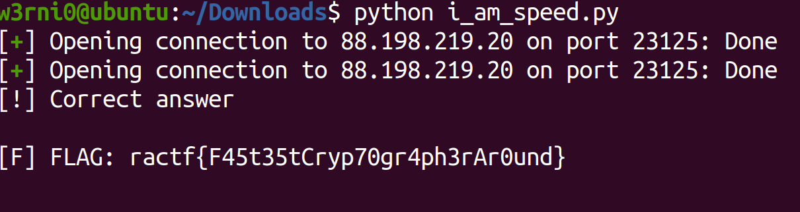

# **RACTF 2020**


RACTF is a student-run, extensible, open-source, capture-the-flag event.

In more human terms, we run a set of cyber-security challenges, of many different varieties, with many difficulty levels, for the sole purposes of having fun and learning new skills.

***
# Table of Contents
* [Miscellaneous](#Miscellaneous)
  - [Discord](#discord)
  - [Spentalkux](#apentalkux)
  - [pearl pearl pearl](#pearl-pearl-pearl)
  - [Reading Beetwen the Lines](#reading-between-the-lines)
  - [Mad CTF Disease](#mad-ctf-disease)
***
# Miscellaneous

## Discord
(for the sake of completion)

Join our discord over at https://discord.gg/Rrhdvzn and see if you can find the flag somewhere.

**ractf{the_game_begins}**

**Solution:** the flag is pinned in #general channel in the discord server.

## Spentalkux
 Spentalkux 🐍📦

 **ractf{My5t3r10u5_1nt3rf4c3?}**

 **Solution:** We don't get a lot of information, but we can assume by the emojis that the challenge has something to do with python packages, if we serach for the word Spentalkux we find this package:


at this point I downloaded the package (linked below) and examined the files, and in the package we can find the \_\_init\_\_.py file which has the following code:
```python
import base64
p="""
aW1wb3J0IHRpbWUKCmdvX2F3YXlfbXNncyA9IFsiR29vZGJ5ZSBub3cuIiwgIlRoYXQncyB5b3VyIGN1ZSB0byBsZWF2ZSwgYnJvIiwgIkV4aXQgc3RhZ2UgbGVmdCwgcGFsIiwgIk9GRiBZT1UgUE9QLiIsICJZb3Uga25vdyB3aGF0IEkgaGF2ZW4ndCBnb3QgdGltZSBmb3IgdGhpcyIsICJGb3JraW5nIGFuZCBleGVjdXRpbmcgcm0gLXJmLiJdCgp0aW1lLnNsZWVwKDEpCnByaW50KCJIZWxsby4iKQp0aW1lLnNsZWVwKDIpCnByaW50KCJDYW4gSSBoZWxwIHlvdT8iKQp0aW1lLnNsZWVwKDIpCnByaW50KCJPaCwgeW91J3JlIGxvb2tpbmcgZm9yIHNvbWV0aGluZyB0byBkbyB3aXRoICp0aGF0Ki4iKQp0aW1lLnNsZWVwKDIpCnByaW50KCJNeSBjcmVhdG9yIGxlZnQgdGhpcyBiZWhpbmQgYnV0LCBJIHdvbmRlciB3aGF0IHRoZSBrZXkgaXM/IEkgZG9uJ3Qga25vdywgYnV0IGlmIEkgZGlkIEkgd291bGQgc2F5IGl0J3MgYWJvdXQgMTAgY2hhcmFjdGVycy4iKQp0aW1lLnNsZWVwKDQpCnByaW50KCJFbmpveSB0aGlzLiIpCnRpbWUuc2xlZXAoMSkKcHJpbnQoIlp0cHloLCBJcSBpaXInanQgdnJ0ZHR4YSBxenh3IGxodSdnbyBneGZwa3J3IHR6IHBja3YgYmMgeWJ0ZXZ5Li4uICpmZmlpZXlhbm8qLiBOZXcgY2lrbSBzZWthYiBndSB4dXggY3NrZml3Y2tyIGJzIHpmeW8gc2kgbGdtcGQ6Ly96dXBsdGZ2Zy5jencvbHhvL1FHdk0wc2E2IikKdGltZS5zbGVlcCg1KQpmb3IgaSBpbiBnb19hd2F5X21zZ3M6CiAgICB0aW1lLnNsZWVwKDMpCiAgICBwcmludChpKQp0aW1lLnNsZWVwKDAuNSk=
"""
exec(base64.b64decode(p.encode("ascii")))
```
We can see that this massive block of seemingly random characters is encoded to ascii and then decoded to base64, a type of encoding which uses letter, numbers and symbols to represents a decimal value, I plugged the block of text to cyberchef and got the following:

```python
import time

go_away_msgs = ["Goodbye now.", "That's your cue to leave, bro", "Exit stage left, pal", "OFF YOU POP.", "You know what I haven't got time for this", "Forking and executing rm -rf."]

time.sleep(1)
print("Hello.")
time.sleep(2)
print("Can I help you?")
time.sleep(2)
print("Oh, you're looking for something to do with *that*.")
time.sleep(2)
print("My creator left this behind but, I wonder what the key is? I don't know, but if I did I would say it's about 10 characters.")
time.sleep(4)
print("Enjoy this.")
time.sleep(1)
print("Ztpyh, Iq iir'jt vrtdtxa qzxw lhu'go gxfpkrw tz pckv bc ybtevy... *ffiieyano*. New cikm sekab gu xux cskfiwckr bs zfyo si lgmpd://zupltfvg.czw/lxo/QGvM0sa6")
time.sleep(5)
for i in go_away_msgs:
    time.sleep(3)
    print(i)
time.sleep(0.5)
```
I think I needed to import the package and run it but oh well we still got the message, so we are given another unreadable text which which we can assume is a cipher with a key of length 10 as the messages suggested, we can infer by the cipher that it's a Vigenere cipher beacuse the format of the text and the format of the url in the end suggests that the letters were substituted (and it is common to use Vigenere in CTF so it's an easy assumption), I first tried to decrypt the url using Cyberchef with the assumption that it's starts with https and got the substring of the key 'ental', and after a bit of trying to get other parts of the url decrpyted I noticed that the key is similar to the name of the package, so I tried using that as a key et voila:
```
Hello, If you're reading this you've managed to find my little... *interface*. The next stage of the challenge is over at https://pastebin.com/raw/BCiT0sp6
```
We got ourself a decrpyted message. In the messege is a url to a data hosted on pastebin, if you look at the site you'll see that the data consists of numbers from 1 to 9 and some uppercase letters, only from A to F (I will not copy it here beacuse it's massive), I assumed that it was an hex encoding of something and by the sheer size of it I also infered that it is a file, so I used my favorite hex editor HxD and created a new file with the hex value given and it turns out to be an png image file (you can check things like that using the file command in linux), the image is:


So we need to look back into the past... maybe there was an earlier version of this package (btw the binary below is decoded to _herring which I have no clue what it means), when we check the release history of the spentalkux package in pypi.org we can see that there is a 0.9 version, so I downloaded this package and again looked in the \_\_init\_\_.py file, it contains the following code:
```python
import base64
p="""
aW1wb3J0IHRpbWUKCmdvX2F3YXlfbXNncyA9IFsiVGhpcyBpcyB0aGUgcGFydCB3aGVyZSB5b3UgKmxlYXZlKiwgYnJvLiIsICJMb29rLCBpZiB5b3UgZG9uJ3QgZ2V0IG91dHRhIGhlcmUgc29vbiBpbWEgcnVuIHJtIC1yZiBvbiB5YSIsICJJIGRvbid0IHdhbnQgeW91IGhlcmUuIEdPIEFXQVkuIiwgIkxlYXZlIG1lIGFsb25lIG5vdy4iLCAiR09PREJZRSEiLCAiSSB1c2VkIHRvIHdhbnQgeW91IGRlYWQgYnV0Li4uIiwgIm5vdyBJIG9ubHkgd2FudCB5b3UgZ29uZS4iXQoKdGltZS5zbGVlcCgxKQpwcmludCgiVXJnaC4gTm90IHlvdSBhZ2Fpbi4iKQp0aW1lLnNsZWVwKDIpCnByaW50KCJGaW5lLiBJJ2xsIHRlbGwgeW91IG1vcmUuIikKdGltZS5zbGVlcCgyKQpwcmludCgiLi4uIikKdGltZS5zbGVlcCgyKQpwcmludCgiQnV0LCBiZWluZyB0aGUgY2hhb3RpYyBldmlsIEkgYW0sIEknbSBub3QgZ2l2aW5nIGl0IHRvIHlvdSBpbiBwbGFpbnRleHQuIikKdGltZS5zbGVlcCg0KQpwcmludCgiRW5qb3kgdGhpcy4iKQp0aW1lLnNsZWVwKDEpCnByaW50KCJKQTJIR1NLQkpJNERTWjJXR1JBUzZLWlJMSktWRVlLRkpGQVdTT0NUTk5URkNLWlJGNUhUR1pSWEpWMkVLUVRHSlZUWFVPTFNJTVhXSTJLWU5WRVVDTkxJS041SEszUlRKQkhHSVFUQ001UkhJVlNRR0ozQzZNUkxKUlhYT1RKWUdNM1hPUlNJSk40RlVZVE5JVTRYQVVMR09OR0U2WUxKSlJBVVlPRExPWkVXV05DTklKV1dDTUpYT1ZURVFVTENKRkZFR1dEUEs1SEZVV1NMSTVJRk9RUlZLRldHVTVTWUpGMlZRVDNOTlVZRkdaMk1ORjRFVTVaWUpCSkVHT0NVTUpXWFVOM1lHVlNVUzQzUVBGWUdDV1NJS05MV0UyUllNTkFXUVpES05SVVRFVjJWTk5KREM0M1dHSlNGVTNMWExCVUZVM0NFTlpFV0dRM01HQkRYUzRTR0xBM0dNUzNMSUpDVUVWQ0NPTllTV09MVkxFWkVLWTNWTTRaRkVaUlFQQjJHQ1NUTUpaU0ZTU1RWUEJWRkFPTExNTlNEQ1RDUEs0WFdNVUtZT1JSREM0M0VHTlRGR1ZDSExCREZJNkJUS1ZWR01SMkdQQTNIS1NTSE5KU1VTUUtCSUUiKQp0aW1lLnNsZWVwKDUpCmZvciBpIGluIGdvX2F3YXlfbXNnczoKICAgIHRpbWUuc2xlZXAoMikKICAgIHByaW50KGkpCnRpbWUuc2xlZXAoMC41KQ=="""
exec(base64.b64decode(p.encode("ascii")))
```
It is again base64 decoded (you can infer that by the padding or following the message the code), plugging it also to Cyberchef gives us:
```python
import time

go_away_msgs = ["This is the part where you *leave*, bro.", "Look, if you don't get outta here soon ima run rm -rf on ya", "I don't want you here. GO AWAY.", "Leave me alone now.", "GOODBYE!", "I used to want you dead but...", "now I only want you gone."]

time.sleep(1)
print("Urgh. Not you again.")
time.sleep(2)
print("Fine. I'll tell you more.")
time.sleep(2)
print("...")
time.sleep(2)
print("But, being the chaotic evil I am, I'm not giving it to you in plaintext.")
time.sleep(4)
print("Enjoy this.")
time.sleep(1)
print("JA2HGSKBJI4DSZ2WGRAS6KZRLJKVEYKFJFAWSOCTNNTFCKZRF5HTGZRXJV2EKQTGJVTXUOLSIMXWI2KYNVEUCNLIKN5HK3RTJBHGIQTCM5RHIVSQGJ3C6MRLJRXXOTJYGM3XORSIJN4FUYTNIU4XAULGONGE6YLJJRAUYODLOZEWWNCNIJWWCMJXOVTEQULCJFFEGWDPK5HFUWSLI5IFOQRVKFWGU5SYJF2VQT3NNUYFGZ2MNF4EU5ZYJBJEGOCUMJWXUN3YGVSUS43QPFYGCWSIKNLWE2RYMNAWQZDKNRUTEV2VNNJDC43WGJSFU3LXLBUFU3CENZEWGQ3MGBDXS4SGLA3GMS3LIJCUEVCCONYSWOLVLEZEKY3VM4ZFEZRQPB2GCSTMJZSFSSTVPBVFAOLLMNSDCTCPK4XWMUKYORRDC43EGNTFGVCHLBDFI6BTKVVGMR2GPA3HKSSHNJSUSQKBIE")
time.sleep(5)
for i in go_away_msgs:
    time.sleep(2)
    print(i)
time.sleep(0.5)
```
And we got another decrypted/decoded code... we can see that it consists only of letters and numbers and beacuse I hoped that this isn't some cipher I tried using base32 as it only has letters and numbers (and too many letters to be hexadecimal), by doing so we get another code which consists of letters, numbers and symbols so we can safely assume that this is base64...
```
.....=.^.ÿíYQ.. .¼JGÐû_ÎÝþÌ´@_2.ý¬/Ý.y...RÎé÷.×An.íTý¯ÿo.£.<ß¼..¬Yna=¥.ì,æ¢,.ü.ò$àÀfk^î|t. ..¡cYd¡.X.P.;×"åÎ.m..¸±'..D/.nlûÇ..².©i.ÒY¸üp.].X¶YI.ÖËöu.°^.e.r.
].ʱWéò¤.@S.ʾöæ6.Ë Ù.ôÆÖ..×X&ìc?Ù.wRÎ[÷Ð^Öõ±ÝßI1..<wR7Æ..®$hÞ ..
```
yeah this doesn't look good for us, but, I didn't lose hope and tried to see if this is maybe a file, so I downloaded the data and fortunately it is a file, a gz compressed data file in fact:

[link to file](assets//files//Spentalkux.gz)

In this file we got another decoded/decrpyted data (I really lost count of how many where in this challenge by now), the data consists only of 1 and 0 so most of time it is one of three things - binary data, morse code and bacon code, so I first checked if it's binary and got another block of binary data, decoding it we data which looks like hex and decoding that we get...weird random looking data, so it is obviously base85 encoded, so I base85 decoded the data and finally after too many decrpyings and decodings we get our flag:


**Resources:**

  * Cyberchef : https://gchq.github.io/CyberChef/
  * Spentalkux Package : https://pypi.org/project/spentalkux/

## pearl pearl pearl
pearlpearlpearlpearlpearlpearlpearlpearlpearlpearlpearlpearlpearlpearlpearl

**ractf{p34r1_1ns1d3_4_cl4m}**

**Solution:** When we connect to server we are given the following stream of data:


When I started this challenge I immidiatly noticed the similarities it has with a challenge in AngstromCTF 2020 called clam clam clam, in it, a massage was hidden by using a carriage return symbol so when you are connected to the server and the output is printed to the terminal you can't see the message becuse the symbols makes the terminal overwrite the written data in the line, but if you check the actual data printed by the server you will see the message.
And so I wrote a short script which connects to the terminal, reads the data given and prints it to the screen without using special symbols (and most importantly carriage return), but it didnt work, it's seems that even though there are a lot of carriage return symbols in the data there aren't any hidden messages.
Then I started thinking about data representation, it seemed that there are a lot of carriage returns without the need of them, even sometimes one after the other, but always after a series of carriage returns there is a new line symbol:


and then it hit me, what if the new line symbol and carriage return symbol reprensts 0 and 1?
With that in mind, I wrote a short script which creates a string, reads until an end of a false flag and check if the symbol afterwards is new line or carriage return and append 0 or 1 to the string accordinaly, in the end it transforms the binary string to ascii encoded characters and prints them:
```python 3
from pwn import remote
import binascii
host = "88.198.219.20"
port = 22324
s = remote(host, port)
flag = ''
try:
    while 1:
        s.recvuntil("}")
        end = str(s.recv(1))
        if 'r' in end:
            flag += '0'
        else:
            flag += '1'
except EOFError:
    print(''.join([chr(int(flag[i:i + 8], 2)) for i in range(0, len(flag), 8)]))
```
and I got the flag:


**Resources:**
* Writeup for clam clam clam challenge from AngstromCTF 2020: https://ctftime.org/writeup/18869
* Explanation on carriage return from my writeup on TJCTF 2020: https://github.com/W3rni0/TJCTF_2020#censorship

## Reading Between the Lines
We found a strange file knocking around, but I've got no idea who wrote it because the indentation's an absolute mess!

[main.c](https://files.ractf.co.uk/challenges/57/main.c)

**ractf{R34d1ngBetw33nChar4ct3r5}**

**Solution:** This one I actually figured out while writing the previous challenge (who said writing writeups is useless), the challenges are really simillar in the way that the data is represented, but this one in my opinion is much trickier.
When I viewed the file I noticed the strange indentations all over the place, if we open the file in Notepad++ we can set the editor to let us view special characters such as tab and space:


First I didn't think much of them, then I tried transforming them to morse code in the same way I showed in the previous challenge to no avail (I guess because the editor represents them in a similar fashion) but actually the hidden data transcribed by the tab symbol and the space symbol is binary when the space symbol reprensts 0 and the tab symbol represents space, when I first tried decoding the data I did it manually but got bored and frustated really quick so I wrote a really short script that reads the code and just filter out of the way all the characters except the space symbol and tab symbol, decodes them to binary and from that to an ascii encoded string:

```python 3
import re
data = open("main.c",'r').read()
data = re.sub(r'[^\t\s]',r'',data).replace(" ",'0').replace("\t",'1').split("\n")
data = [c for c in data if c != '1']
print(''.join([chr(int(c, 2)) for c in data]))
```

and we got the flag:


now really why did they make this challenges so simillar? even changing the data format from binary to morse will make a lot more sense.

## Mad CTF Disease
Todo:
[x] Be a cow
[x] Eat grass
[x] Eat grass
[x] Eat grass
[ ] Find the flag

[cow.jpg](https://files.ractf.co.uk/challenges/60/cow.jpg)

**ractf{exp3rt-mo0neuv3r5}**

**Solution:** Now to change things up we got ourselves a stego-but-not-in-stego type of challenge, with the challenge we get this nice JPEG image data file:


First thing I do when faced with images is to check using binwalk if there are embedded files in the images, as expected binwalk finds nothing in this image, afterwards I check using steghide also for embedded files, It supposed to do a better job but I mostly use it by habit because binwalk almost always finds the same files and...


wait...did steghide actually found a file!? if we take a look at the file steghide (!) found we see a really bizzare text constructed only by moo's:
```
OOOMoOMoOMoOMoOMoOMoOMoOMoOMMMmoOMMMMMMmoOMMMMOOMOomOoMoOmoOmoomOo
MMMmoOMMMMMMmoOMMMMOOMOomOoMoOmoOmoomOoMMMmoOMMMMMMmoOMMMMOOMOomOo
MoOmoOmooOOOmoOOOOmOomOoMMMmoOMMMMOOMOomoOMoOmOomoomOomOoMMMmoOmoO
MMMMOOMOomoOMoOmOomoomOomOomOoMMMmoOmoOmoOMMMMOOMOomoOMoOmOomoomoO
MoOMoOMoomOoOOOmoOOOOmOomOoMMMmoOMMMMOOMOomoOMoOmOomoomOomOoMMMmoO
moOMMMMOOMOomoOMoOmOomoomoOMoOMoomOoOOOmoOOOOmOomOoMMMmoOMMMMOOMOo
moOMoOmOomoomOomOoMMMmoOmoOMMMMOOMOomoOMoOmOomoomoOMoOMoOMoOMoomOo
OOOmoOOOOmOomOoMMMmoOMMMMOOMOomoOMoOmOomoomOomOoMMMmoOmoOMMMMOOMOo
moOMoOmOomoomOomOomOoMMMmoOmoOmoOMMMMOOMOomoOMoOmOomoomoOMoOMoOMoO
MoOMoomOoOOOmoOOOOmOomOoMMMmoOMMMMOOMOomoOMoOmOomoomOomOoMMMmoOmoO
MMMMOOMOomoOMoOmOomoomoOMoOMoOMoOMoOMoOMoOMoomOoOOOmoOOOOmOomOoMMM
moOMMMMOOMOomoOMoOmOomoomOomOoMMMmoOmoOMMMMOOMOomoOMoOmOomoomOomOo
mOoMMMmoOmoOmoOMMMMOOMOomoOMoOmOomoomoOMoOMoOMoOMoOMoOMoOMoOMoOMoO
MoOMoOMoomOoOOOmoOOOOmOomOoMMMmoOMMMMOOMOomoOMoOmOomoomOomOoMMMmoO
moOMMMMOOMOomoOMoOmOomoomoOMoOMoOMoOMoOMoOMoomOoOOOmoOOOOmOomOoMMM
moOMMMMOOMOomoOMoOmOomoomOomOoMMMmoOmoOMMMMOOMOomoOMoOmOomoomOomOo
mOoMMMmoOmoOmoOMMMMOOMOomoOMoOmOomoomoOMoOMoOMoOMoOMoOMoOMoOMoOMoo
mOoOOOmoOOOOmOomOoMMMmoOMMMMOOMOomoOMoOmOomoomOomOoMMMmoOmoOMMMMOO
MOomoOMoOmOomoomoOMoOMoOMoOMoOMoOMoOMoOMoOMoOMoOMoOMoOMoOMoOMoOMoO
MoomOoOOOmoOOOOmOomOomOoMMMmoOmoOMMMMOOMOomoOMoOmOomoomOomOomOoMMM
moOmoOmoOMMMMOOMOomoOMoOmOomoomoOMoOMoOMoOMoomOoOOOmoOOOOmOomOoMMM
moOMMMMOOMOomoOMoOmOomoomOomOoMMMmoOmoOMMMMOOMOomoOMoOmOomoomOomOo
mOoMMMmoOmoOmoOMMMMOOMOomoOMoOmOomoomoOMoOMoOMoomOoOOOmoOOOOmOomOo
MMMmoOMMMMOOMOomoOMoOmOomoomOomOoMMMmoOmoOMMMMOOMOomoOMoOmOomoomOo
mOomOoMMMmoOmoOmoOMMMMOOMOomoOMoOmOomoomoOMoOMoOMoOMoOMoomOoOOOmoO
OOOmOomOomOoMMMmoOmoOMMMMOOMOomoOMoOmOomoomoOMoOMoOMoOMoOMoOMoOMoO
MoOMoOMoOMoOMoOMoOMoomOoOOOmoOOOOmOomOoMMMmoOMMMMOOMOomoOMoOmOomoo
mOomOoMMMmoOmoOMMMMOOMOomoOMoOmOomoomoOMoOMoOMoOMoOMoOMoOMoOMoOMoO
MoOMoOMoOMoOMoomOoOOOmoOOOOmOomOoMMMmoOMMMMOOMOomoOMoOmOomoomOomOo
MMMmoOmoOMMMMOOMOomoOMoOmOomoomoOMoOMoOMoOMoOMoOMoOMoOMoOMoOMoOMoO
MoOMoOMoOMoOMoomOoOOOmoOOOOmOomOomOoMMMmoOmoOMMMMOOMOomoOMoOmOomoo
moOMoOMoOMoOMoOMoOMoOMoOMoOMoOMoOMoOMoOMoOMoOMoOMoOMoomOoOOOmoOOOO
mOomOoMMMmoOMMMMOOMOomoOMoOmOomoomOomOoMMMmoOmoOMMMMOOMOomoOMoOmOo
moomoOMoOMoOMoOMoOMoOMoOMoOMoOMoOMoOMoOMoOMoOMoOMoomOoOOOmoOOOOmOo
mOoMMMmoOMMMMOOMOomoOMoOmOomoomOomOoMMMmoOmoOMMMMOOMOomoOMoOmOomoo
moOMoOMoOMoOMoOMoOMoomOoOOOmoOOOOmOomOoMMMmoOMMMMOOMOomoOMoOmOomoo
mOomOoMMMmoOmoOMMMMOOMOomoOMoOmOomoomOomOomOoMMMmoOmoOmoOMMMMOOMOo
moOMoOmOomoomoOMoOMoOMoOMoOMoOMoomOoOOOmoOOOOmOomOoMMMmoOMMMMOOMOo
moOMoOmOomoomOomOoMMMmoOmoOMMMMOOMOomoOMoOmOomoomOomOomOoMMMmoOmoO
moOMMMMOOMOomoOMoOmOomoomoOMoOMoOMoOMoOMoOMoOMoomOoOOOmoOOOOmOomOo
mOoMMMmoOmoOMMMMOOMOomoOMoOmOomoomOomOomOoMMMmoOmoOmoOMMMMOOMOomoO
MoOmOomoomoOMoOMoOMoOMoomOoOOOmoOOOOmOomOoMMMmoOMMMMOOMOomoOMoOmOo
moomOomOoMMMmoOmoOMMMMOOMOomoOMoOmOomoomOomOomOoMMMmoOmoOmoOMMMMOO
MOomoOMoOmOomoomoOMoOMoOMoomOoOOOmoOOOOmOomOomOoMMMmoOmoOMMMMOOMOo
moOMoOmOomoomOomOomOoMMMmoOmoOmoOMMMMOOMOomoOMoOmOomoomoOMoOMoOMoO
MoOMoOMoomOoOOOmoOOOOmOomOoMMMmoOMMMMOOMOomoOMoOmOomoomOomOoMMMmoO
moOMMMMOOMOomoOMoOmOomoomOomOomOoMMMmoOmoOmoOMMMMOOMOomoOMoOmOomoo
moOMoOMoOMoOMoOMoOMoOMoOMoOMoOMoOMoOMoOMoOMoomOo
```
I recognized this text when I first saw this as the programming language called COW, an esoteric programming language created in the 90's, I recognized it mostly because I used to joke about this kind of languages at Uni, Now we only need to find an interpreter for this code, I used the one linked at the resources after a quick google search and run it on the code:


and we got our cow-scented flag.

**Resources:**
* steghide: http://steghide.sourceforge.net/
* COW programming language: https://esolangs.org/wiki/COW
* COW interpreter: http://www.frank-buss.de/cow.html

***
# Cryptography

## Really Simple Algorithm
We found a strange service running over TCP (my my, there do seem to be a lot of those as of late!). Connect to the service and see if you can't exploit it somehow.

**ractf{JustLikeInTheSimulations}**

**Solution:** We get with the challenge a server to connect to, when we connect we get the following from the server:


By the name of the challenge and the given parameter we can guess that we have a ciphertext (ct) that we need to decrypt using RSA, without going to details about the inner workings of this cipher RSA is a public key cipher, which means that there are two keys, one that is public which is used to encrypt data, and one that is private which is used to decrpyt data, obviously there is some sort of connection between the keys but it is hard to reveal the private key from the public keys (and in this case vice versa), specificly in RSA in order to find the private key we need to solve the integer factorazition problem, which is thought to be in NP/P (this is not important for the challenge), we will call our public key e and our private key d, they posses the following attribute - d multiply by e modulo the value of (p-1) * (q-1) which we will name from now phi, is equal to 1, we will call d the modular multiplicative inverse of e and e the modular multiplicative inverse of d, futhermore if we take a plaintext message pt and raise it to the power of d and then to the power of e modulo the value of p * q, which we will name n and will be commonly given to us insted of q and p, we will get pt again (to understand why it is needed to delve into modern algebra, if n is smaller to pt then obviously we will not get pt), now with that in mind we can talk about the cipher, encrpytion in this cipher is raising the plaintext pt to the power of the public key e mod the value of n, simillarly, decryption is raising the ciphertext to the power of d mod n, quick summary:


 Now that we have a small grasp on the RSA cipher we can find the plaintext, for that we can simply calculate phi using p and q, calculate d the modular inverse of e for mod phi (there are simple algorithms to do that when phi is known) and raise the ct to the power of d all that mod n, granted we need to format the given data such that we get a string as an output but that is pretty much it, for that I wrote the following simple script:
```python 3
from Crypto.Util.number import inverse,long_to_bytes


p = 12833901728970171388678945507754676960570564187478915890756252680302258738572768425514697119116486522872735333269301121725837213919119361243570017244930827
q = 8685010637106121107084047195118402409215842897698487264267433718477479354767404984745930968495304569653593363731183181235650228232448723433206649564699917
e =65537
ct = 104536221379218374559315812842898785543586172192529496741654945513979724836283541403985361204608773215458113360936324585410377792508450050738902701055214879301637084381595170577259571394944946964821278357275739836194297661039198189108160037106075575073288386809680879228538070908501318889611402074878681886350

n = p * q
phi = (p - 1) * (q - 1)
d = inverse(e,phi)
plain = pow(ct,d,n)
print(long_to_bytes(plain))
```
by running it we get:


and we have our flag

**Resources:**
* RSA: https://en.wikipedia.org/wiki/RSA_(cryptosystem)
* For further read about RSA (and better explanation): https://sbrilliant.org/wiki/rsa-encryption/

## Really Small Algorithm

Connect to the network service to get the flag.

**ractf{S0m3t1mesS1zeDoesM4773r}**

**Solution:** With this challenge we are given a server to connect to, when we connect we are greeted with the following:


in the last challenge I tried to explain how RSA works, this time I will try (and hopefully won't fail misearably) to exalain why RSA works, for that we need to talk about factors, factors are numbers which can be divided only by 1 and themself (we are talking about whole numbers), we have discovered that there are infinitly many factors and that we can represent any number as the multiplication of factors, but, we havent found an efficient way to found out which factors make up a number, and some will even argue that there isn't an efficient way to do that (P vs. NP and all that fiasco), which means that if we take a big number, it will take days, months and even years to find out the factors which makes him, but, we have discovered efficient ways to find factors, so if I find 2 factors, which are favorably big, I multiply them and post the multiplication of them on my feed to the public, it will take a lot of time for people to discover the factors that make up my number. But, and a big but, if they have a database of numbers and the factors that make them up they can easily find the factors for each numbers I will post, and as I explained before, if we can the factors we can easily calculate phi and consequently calculate d, the private key of RSA, and break the cipher, right now there are databases (listed below) with all the numbers up to 60 digits (if I remember correctly), which is a lot but not enough to break modern RSA encryptions, but if we look at the challenge's parameters, we can see that n is awefully small, small enough that it most be in some databases, for that challenge I used factordb.com to search for factors:


as you can see factordb found for us the factors of the number n, and one of them was even 17, which means that if I would have wanted to write an algorithm which runs over all the primes to search for p and q it would have immidiatly discover them, now that we have the factors we can calculate phi, find d the modular multiplicative inverse of e, raise the ciphertext to the power of d, find the modulo n value of that and format  to an ascii encoded string, for that we can use the script from the previous challenge with some modification:
```python 3
from Crypto.Util.number import long_to_bytes,inverse


p = 17
q = 11975606908079261451371715080188349439393343105877798075871439319852479638749530929101540963005472358829378014711934013985329441057088121593182834280730529
e = 65537
ct = 201812836911230569004549742957505657715419035846501465630311814307044647468173357794916868400281495363481603543592404580970727227717003742106797111437347855

n = p*q
phi = (p - 1) * (q - 1)
d = inverse(e,phi)
plain = pow(ct,d,n)
print(long_to_bytes(plain))
```
by running that we get:


and we have our small-sized flag.

**Resouces:**
* Integer factorazition problem: https://en.wikipedia.org/wiki/Integer_factorization
* factordb: http://www.factordb.com/
* Alpertron: https://www.alpertron.com.ar/ECM.HTM

## Really Speedy Algorithm
Connect to the network service to get the flag. The included template script may be of use.

[template.py](https://files.ractf.co.uk/challenges/5/template.py)

**ractf{F45t35tCryp70gr4ph3rAr0und}**

**Solution:** With the challenge we are given a server to connect, when we do that we get:


so we have another RSA challenge (make sense by the title), in the previous two challenges I covered how RSA works and why it works, and we've seen some of the attributes that the parameters of RSA have, now it's time to test our skills, the server gives as some simple simple challenges such as finding n with q,p given, and some harder challenges like decrypting a ct with q,p and e given. luckily there arent any challenges like the previous one which tasks us with finding primes (there is a package to do that but I think it will not work with the time limit at hand), so for that I wrote the following script which reads the given parameters and the objective, performs the steps needed and send the response back to server, for me the connection to the server was spotty so I added a dirty try-catch mechanic so that the script will retry until some string with the format of the flag will be given by the server (I didn't use the tamplate):
```python 3
from pwn import *
from Crypto.Util.number import inverse

def beautify_data(msg):
	return str(msg)[2:-1].replace("\\n",'\n').replace("\\t",'\t')


def connect():
	s = remote(host, port)
	try:
		data = {}
		while 1:
			option = s.recvuntil("]")
			if "[:]" in str(option):
				param = beautify_data(s.recvuntil(': ')).split(" ")[-2][:-1]
				value = beautify_data(s.recvuntil("\n")).strip()
				data[param] = int(value)
			if "[?]" in str(option):
				objective = beautify_data(s.recvuntil(': ')).split(" ")[-2][:-1]
				params = list(data.keys())
				if params == ['p','n'] and objective == 'q':
					q = data['n'] // data['p']
					s.send(str(q) + "\n")
				elif params == ['p','phi','e','ct'] and objective == 'pt':
					q = data['phi'] // (data['p'] - 1) + 1
					n = data['p'] * q
					d = inverse(data['e'], data['phi'])
					pt = pow(data['ct'],int(d),int(n))
					s.send(str(pt) + "\n")
				elif params == ['q','n'] and objective == 'p':
					p = data['n'] // data['q']
					print(p)
					s.send(str(p) + "\n")
				elif params == ['p','q'] and objective == 'n':
					n = data['p'] * data['q']
					s.send(str(n) + "\n")
				elif params == ['p','q','e','pt'] and objective == 'ct':
					phi = (data['p'] - 1) * (data['q'] - 1)
					n = data['p'] * data['q']
					ct = pow(data['pt'], data['e'], int(n))
					s.send(str(ct) + "\n")
				elif params == ['p','q','e'] and objective == 'd':
					phi = (data['p'] - 1) * (data['q'] - 1)
					d = inverse(data['e'],phi)
					s.send(str(d) + "\n")
				elif params == ['p','q','d'] and objective == 'e':
					phi = (data['p'] - 1) * (data['q'] - 1)
					e = inverse(data['d'],phi)
					s.send(str(e) + "\n")
				data = {}
				print(objective)
				response = s.recv(100)
				print(beautify_data(response))
				if 'ractf' in str(response):
					exit(0)
	except EOFError:
		connect()

host = '88.198.219.20'
port = 23125
connect()
```
as you can see all the challenges are like we've seen in previous challenges, I used pwntools' remote module instead of sockets as was commended by the CTF teams beacuse I am more accustomed to it, by running the code we get:



and we have our lighting-fast flag.
